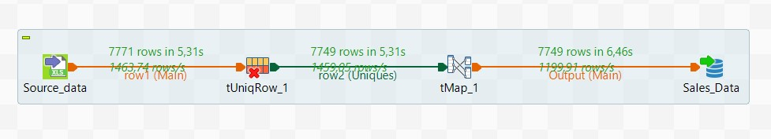
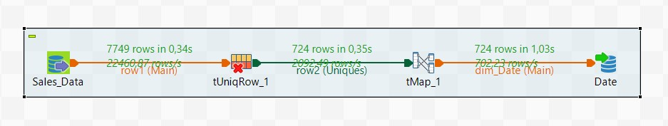
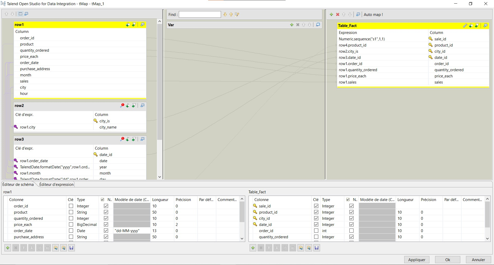
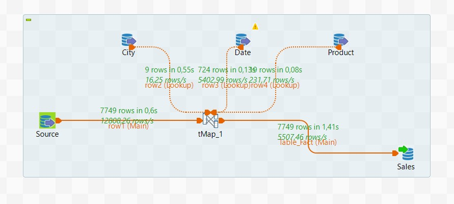
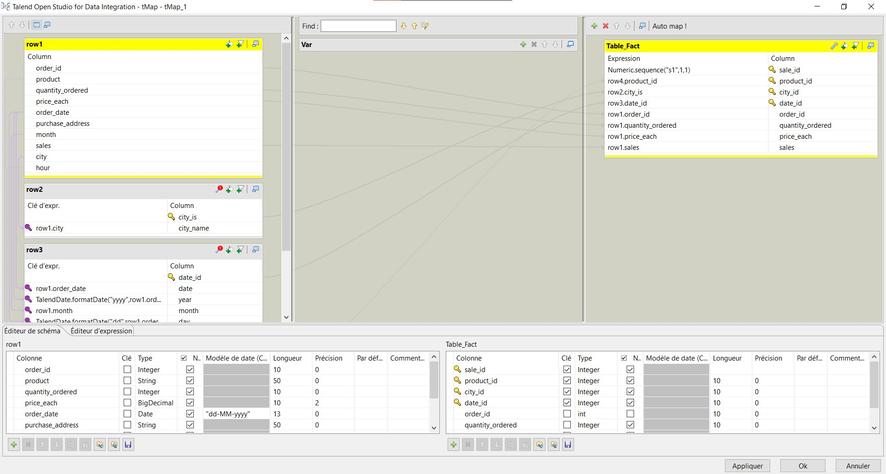
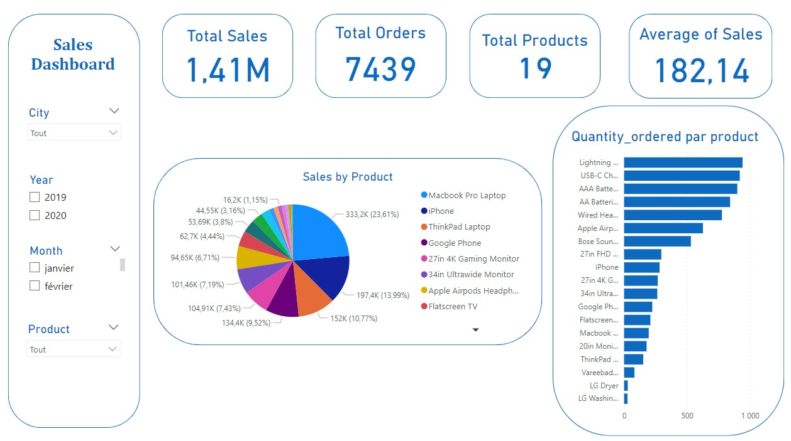

# Sales-Data-Warehouse
A Sales Data Warehouse designed to process, organize, and analyze sales data.

## Data Source

The dataset contains the following fields:

- **Order ID**: Unique identifier for each order.
- **Product**: The name of the product sold.
- **Quantity Ordered**: The number of units ordered.
- **Price Each**: The price per unit of the product.
- **Order Date**: The date when the order was placed.
- **Purchase Address**: The delivery address associated with the order.
- **Month**: The month in which the order was placed.
- **Sales**: The total sales value (Price Each * Quantity Ordered).
- **City**: The city where the order was delivered.
- **Hour**: The hour of the day when the order was placed.

## Tools and Technologies

- **PostgreSQL**: Relational database management system used to store and manage sales data.
- **Talend**: ETL (Extract, Transform, Load) tool used for data integration and processing.
- **Power BI**: Data visualization tool used to create interactive dashboards and reports.

## Implementation
### Loading data into database postgresql
- We loaded our Excel file into a database

### Dimensions Table
#### Date Dimention

- **Sales_Data**: Used as the data source.
- **tUniqRow_1**: Eliminated data redundancy by filtering unique rows.
- **tMap_1**: Mapped and transformed the data.

- **Date**: Used as the destination for the Date Dimension table.

- We did the same for other dimension tables

### Fact Table

### Visualization

